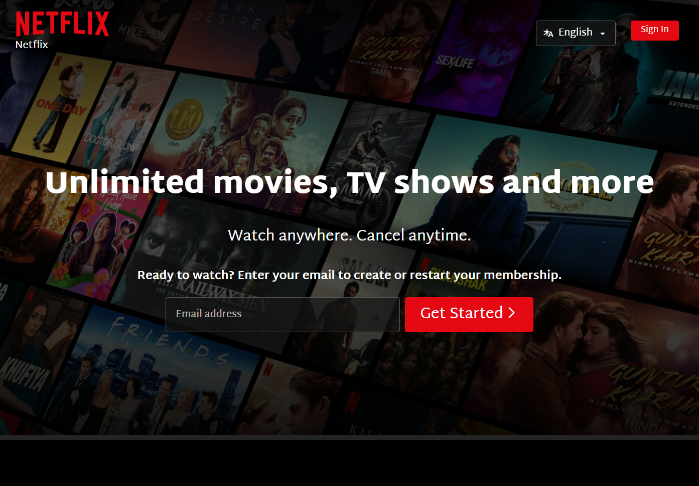

# Netflix Clone Frontend

A responsive Netflix India landing page clone built with HTML and CSS. This project replicates the look and feel of Netflix's homepage, including modern UI elements, custom fonts, and responsive design.

## Features

- 🎬 **Modern Netflix UI**: Faithful recreation of the Netflix India homepage.
- 📱 **Responsive Design**: Looks great on desktop, tablet, and mobile devices.
- 🖋️ **Custom Fonts**: Uses the Netflix Sans and Martel Sans fonts for authentic typography.
- 🌗 **Dark Theme**: True-to-Netflix dark color palette.
- 🖼️ **SVG Logo**: Scalable, accessible Netflix logo.
- 🌐 **Language Selector**: Dropdown for language selection (English/Hindi).
- 📦 **Assets Included**: All images and icons required for the UI.
- ⚡ **No JavaScript Required**: Pure HTML and CSS implementation.

## Demo



## Getting Started

1. **Clone the repository**
   ```sh
   git clone https://github.com/yourusername/netflix-clone-frontend.git
   ```
2. **Open the project**
   - Navigate to the project folder.
   - Open `index.html` in your browser.

## Folder Structure

```
netflix-clone-frontend/
│
├── index.html
├── css/
│   └── style.css
├── assets/
│   ├── boxshot.png
│   ├── child.png
│   ├── device-pile-in.png
│   ├── download-icon.gif
│   ├── indiabg.jpg
│   ├── inficon2023.jpg
│   ├── mobile-0819.jpg
│   └── tv.png
└── README.md
```

## Customization

- **Fonts**: Uses [Netflix Font](https://fonts.cdnfonts.com/css/netflix-font) and [Martel Sans](https://fonts.google.com/specimen/Martel+Sans).
- **Images**: Replace images in the `assets/` folder to customize visuals.
- **Colors**: Modify CSS variables in `style.css` for color changes.

## Credits

- UI inspired by [Netflix](https://www.netflix.com/in/)
- Fonts from [CDN Fonts](https://www.cdnfonts.com/netflix-font.font) and [Google Fonts](https://fonts.google.com/specimen/Martel+Sans)
- Images and icons are for educational/demo purposes only.

## License

This project is for educational and personal use only. Not affiliated with or endorsed by Netflix, Inc.

---

> **Made with ❤️ by Jeevan R (Karnataka, India)**
